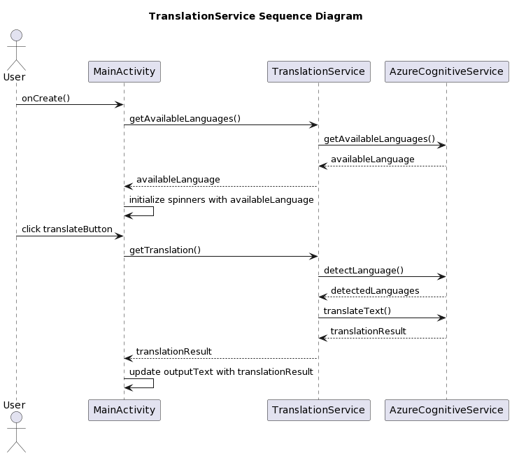
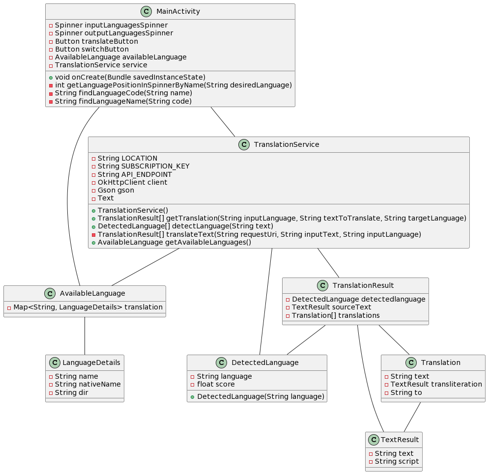

# Salik_Translator_Android

## Description

Salik Translator Android is an Android application that allows users to translate text from one language to another. It utilizes the Microsoft Translator API for language detection and translation.

## Features

The application provides the following functionalities:

- Selecting input language
- Automatic language detection
- Selecting output language
- Entering text to translate
- Language switching

## Project Design 
### Sequence diagram

### class diagram

